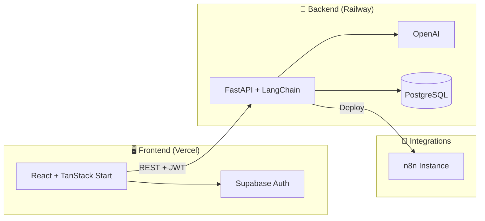

<div align="center">

# ⚡ N8Nexus

### Describe a process. Ship an n8n workflow.

**AI-powered workflow builder** — turn SOPs, PDFs, and plain-English descriptions into structured process specs and production-ready **n8n** automations.

[](https://n8nexus-frontend.vercel.app/)
[](https://n8nexus-backend-production.up.railway.app/)
[](https://fastapi.tiangolo.com)
[](https://react.dev)
[](https://n8n.io)

**[🚀 Open the app](https://n8nexus-frontend.vercel.app/)** · **[📖 API docs](https://n8nexus-backend-production.up.railway.app/docs)** · **[🔌 API root](https://n8nexus-backend-production.up.railway.app/)**

*Automate. Connect. Elevate.*

</div>

---

## 🌟 What is N8Nexus?

N8Nexus helps operators and teams **design, generate, and deploy n8n workflows** without endless drag-and-drop:

| Step | What you do | What N8Nexus does |
|:----:|-------------|-------------------|
| 1️⃣ | Upload SOPs, PDFs, or notes | 📄 Extracts structure from your docs |
| 2️⃣ | Describe the process in plain English | 🧠 Builds a structured process spec |
| 3️⃣ | Review & refine | ⚙️ Generates n8n JSON with triggers, nodes, and error handling |
| 4️⃣ | Deploy | 🚀 Pushes to your n8n instance — cloud or self-hosted |

---

## 🏗️ Architecture



| Layer | Stack | Hosted at |
|:------|:------|:----------|
| 🎨 **Frontend** | React 19 · TanStack Start/Router · Tailwind v4 · Supabase | [n8nexus-frontend.vercel.app](https://n8nexus-frontend.vercel.app/) |
| 🐍 **Backend** | FastAPI · LangChain · OpenAI · SQLAlchemy · PostgreSQL | [n8nexus-backend-production.up.railway.app](https://n8nexus-backend-production.up.railway.app/) |
| 🔐 **Auth** | Supabase (JWT) | Your Supabase project |
| ⚡ **Automation runtime** | n8n REST API | Your n8n cloud or self-hosted instance |

---

## 📁 Repository structure

```
N8Nexus/
├── n8nexus-Frontend/     # ⚛️  React app (Vite · TanStack Start)
│   ├── src/
│   ├── .env.example
│   └── README.md           # Frontend-specific docs
├── n8nexus-Backend/      # 🐍  FastAPI API
│   ├── main.py
│   ├── n8n_templates/
│   ├── .env.example
│   └── README.md           # Backend-specific docs
├── .gitignore
└── README.md               # 👈 You are here
```

---

## ✨ Features

- 🤖 **AI process modeling** — triggers, conditions, integrations, and error handling from conversation
- 📎 **Document grounding** — workflows aligned with your SOPs and PDFs
- 💬 **Streaming chat workspace** — design automations conversationally
- 🔧 **Workflow builder** — sync → generate n8n JSON → deploy
- 📊 **Automations dashboard** — list, inspect, and run saved workflows
- 🔐 **Supabase authentication** — secure per-user automations
- 📤 **Self-host friendly** — export clean n8n JSON for any instance
- 🔌 **200+ integrations** — everything n8n supports (Slack, HubSpot, Stripe, Notion, …)

---

## 🚀 Quick start (local)

### Prerequisites

- 🟢 **Node.js** 20+
- 🐍 **Python** 3.11+
- 🔑 **OpenAI API key**
- 🔐 **Supabase** project (URL + anon key)
- ⚡ **n8n instance** with API key (for deploy)
- 🐘 **PostgreSQL** (optional — required for saved automations)

### 1️⃣ Clone & install

```bash
git clone https://github.com/YOUR_USERNAME/N8Nexus.git
cd N8Nexus
```

### 2️⃣ Backend

```bash
cd n8nexus-Backend
python -m venv .venv

# Windows
.venv\Scripts\activate
# macOS / Linux
# source .venv/bin/activate

pip install -r requirements.txt
cp .env.example .env
# ✏️ Edit .env — add OPENAI_API_KEY, N8N_*, SUPABASE_*, DATABASE_URL

uvicorn main:app --reload --host 0.0.0.0 --port 8000
```

| URL | Purpose |
|:----|:--------|
| http://127.0.0.1:8000/ | API root |
| http://127.0.0.1:8000/docs | Swagger UI |

### 3️⃣ Frontend

```bash
cd n8nexus-Frontend
npm install
cp .env.example .env
# ✏️ Edit .env — see table below

npm run dev
```

👉 Open **http://localhost:8081**

**Recommended local `.env` (frontend):**

```env
VITE_API_BASE_URL=/api
VITE_API_PROXY_TARGET=http://127.0.0.1:8000
VITE_SUPABASE_URL=https://your-project.supabase.co
VITE_SUPABASE_ANON_KEY=your-anon-key
```

**Production frontend `.env`:**

```env
VITE_API_BASE_URL=https://n8nexus-backend-production.up.railway.app
VITE_SUPABASE_URL=https://your-project.supabase.co
VITE_SUPABASE_ANON_KEY=your-anon-key
```

---

## 🔐 Environment variables

### Frontend (`n8nexus-Frontend/.env`)

| Variable | Required | Description |
|:---------|:--------:|:------------|
| `VITE_API_BASE_URL` | ✅ | Backend URL — `/api` locally or Railway URL in prod |
| `VITE_API_PROXY_TARGET` | ➖ | Proxy target when using `/api` (default `http://127.0.0.1:8000`) |
| `VITE_SUPABASE_URL` | ✅ | Supabase project URL |
| `VITE_SUPABASE_ANON_KEY` | ✅ | Supabase anonymous (public) key |

### Backend (`n8nexus-Backend/.env`)

| Variable | Required | Description |
|:---------|:--------:|:------------|
| `OPENAI_API_KEY` | ✅ | OpenAI API key |
| `OPENAI_CHAT_MODEL` | ➖ | Model name (default `gpt-4o-mini`) |
| `N8N_BASE_URL` | 🚀 deploy | n8n instance URL (no trailing slash) |
| `N8N_API_KEY` | 🚀 deploy | n8n API key |
| `DATABASE_URL` | 💾 | PostgreSQL connection string |
| `SUPABASE_URL` | 🔐 | Supabase project URL (JWT validation) |
| `SUPABASE_JWT_SECRET` | 🔐 alt | HS256 secret if not using JWKS |
| `CORS_ORIGINS` | ➖ | Extra allowed origins (comma-separated) |

> ⚠️ **Never commit** `.env` files. Use `.env.example` as templates only.

**Example production backend CORS:**

```env
CORS_ORIGINS=https://n8nexus-frontend.vercel.app,http://localhost:8081
```

---

## 📡 API overview

Routes are available at both `/...` and `/api/...` prefixes.

### 💬 Chat

| Method | Endpoint | Description |
|:------:|:---------|:------------|
| `POST` | `/chat` | Stateless chat |
| `POST` | `/chat/sessions` | Create session |
| `POST` | `/chat/session` | Message with history |
| `POST` | `/chat/session/stream` | Streaming NDJSON |
| `GET` | `/chat/sessions/{id}` | Session history |

### 🔧 Workflows

| Method | Endpoint | Description |
|:------:|:---------|:------------|
| `GET` | `/workflows/templates` | List templates |
| `GET` | `/workflows/sessions/{id}/status` | Field readiness |
| `POST` | `/workflows/sessions/{id}/sync` | LLM field extraction |
| `POST` | `/workflows/sessions/{id}/generate` | Build n8n JSON |
| `POST` | `/workflows/sessions/{id}/deploy` | Push to n8n |

### 🤖 Automations *(Bearer JWT required)*

| Method | Endpoint | Description |
|:------:|:---------|:------------|
| `GET` | `/automations` | List user automations |
| `GET` | `/automations/{id}` | Get one automation |
| `POST` | `/automations/{id}/run` | Trigger workflow |

📖 Full interactive docs: **[https://n8nexus-backend-production.up.railway.app/docs](https://n8nexus-backend-production.up.railway.app/docs)**

---

## 🔄 How automation flows work

```
💬 Chat  →  🔍 Sync  →  ⚙️ Generate  →  🚀 Deploy  →  💾 Automations
```

1. **Chat** — AI guides you through describing the automation
2. **Sync** — Extracts template ID and field values from the conversation
3. **Generate** — Fills pre-built n8n workflow JSON from `n8n_templates/`
4. **Deploy** — Creates or updates workflows on your n8n instance
5. **Automations** — Persists results per Supabase user (when `DATABASE_URL` is set)

---

## ☁️ Deployment

### ▲ Frontend — Vercel

1. Import the **`n8nexus-Frontend`** folder (or set it as the root directory in a monorepo)
2. Set environment variables: `VITE_API_BASE_URL`, `VITE_SUPABASE_URL`, `VITE_SUPABASE_ANON_KEY`
3. Deploy

**Live:** [https://n8nexus-frontend.vercel.app/](https://n8nexus-frontend.vercel.app/)

### 🚂 Backend — Railway

1. Deploy from **`n8nexus-Backend`**
2. Set all backend env vars in the Railway dashboard
3. Start command:

```bash
uvicorn main:app --host 0.0.0.0 --port $PORT
```

4. Point frontend `VITE_API_BASE_URL` at your Railway URL
5. Add the Vercel URL to `CORS_ORIGINS`

**Live:** [https://n8nexus-backend-production.up.railway.app/](https://n8nexus-backend-production.up.railway.app/)

> 💡 Chat/workflow **session state is in-memory** on the API — it resets on redeploy. **Automations** in PostgreSQL persist across restarts.

---

## 📤 Push to GitHub

### First-time setup

```bash
cd path/to/N8Nexus

git init
git add .
git commit -m "Initial commit: N8Nexus monorepo"
```

Create a new repository on [GitHub](https://github.com/new) (empty, no README), then:

```bash
git branch -M main
git remote add origin https://github.com/YOUR_USERNAME/N8Nexus.git
git push -u origin main
```

### Before you push — checklist

- ✅ Root `.gitignore` is in place (excludes `node_modules/`, `.venv/`, `.env`)
- ✅ No secrets in committed files — only `.env.example` templates
- ✅ `node_modules` is **not** tracked (run `git status` and confirm)

### Monorepo tip

If you deploy from subfolders, configure each host separately:

| Service | Root directory |
|:--------|:---------------|
| Vercel | `n8nexus-Frontend` |
| Railway | `n8nexus-Backend` |

---

## 🛠️ Tech stack

| Area | Technologies |
|:-----|:-------------|
| **Frontend** | React 19 · Vite 7 · TanStack Start/Router/Query · Tailwind CSS v4 · Radix UI · Supabase JS |
| **Backend** | FastAPI · Uvicorn · LangChain · OpenAI · SQLAlchemy 2 · psycopg · PyJWT |
| **Integrations** | n8n REST API · Supabase Auth · PostgreSQL |
| **Hosting** | Vercel (frontend) · Railway (backend) |

---

## 🩺 Troubleshooting

| Symptom | Fix |
|:--------|:----|
| ⏱️ API timeout locally | Backend running on port **8000**? `VITE_API_BASE_URL=/api` + proxy set? |
| 🚫 CORS in production | Add `https://n8nexus-frontend.vercel.app` to backend `CORS_ORIGINS` |
| 🔐 “Sign in required” | Log in via Supabase; ensure backend `SUPABASE_URL` matches your project |
| 📭 Empty automations | Set `DATABASE_URL` on Railway; send valid `Authorization: Bearer <jwt>` |
| `502` on chat | Check `OPENAI_API_KEY`, model name, and OpenAI quota |
| Deploy fails | Verify `N8N_BASE_URL` and `N8N_API_KEY` on the backend |

---

## 📚 More documentation

| Package | README |
|:--------|:-------|
| ⚛️ Frontend | [n8nexus-Frontend/README.md](./n8nexus-Frontend/README.md) |
| 🐍 Backend | [n8nexus-Backend/README.md](./n8nexus-Backend/README.md) |

---

## 🤝 Contributing

1. 🍴 Fork the repository  
2. 🌿 Create a feature branch (`git checkout -b feature/amazing-feature`)  
3. ✅ Commit your changes  
4. 📤 Push and open a Pull Request  

---


<div align="center">

**Built with ❤️ for the n8n automation generation**

[🌐 Live app](https://n8nexus-frontend.vercel.app/) · [📖 API docs](https://n8nexus-backend-production.up.railway.app/docs)

© 2026 N8Nexus — *Automate. Connect. Elevate.*

</div>
